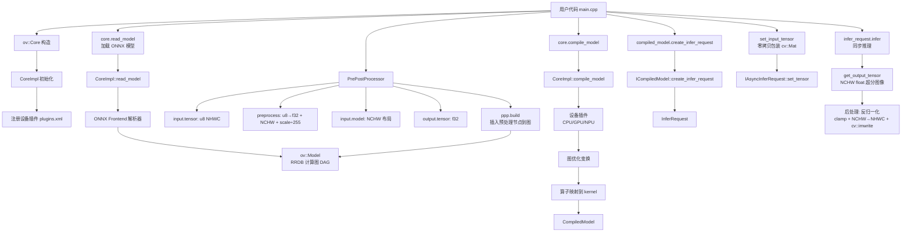
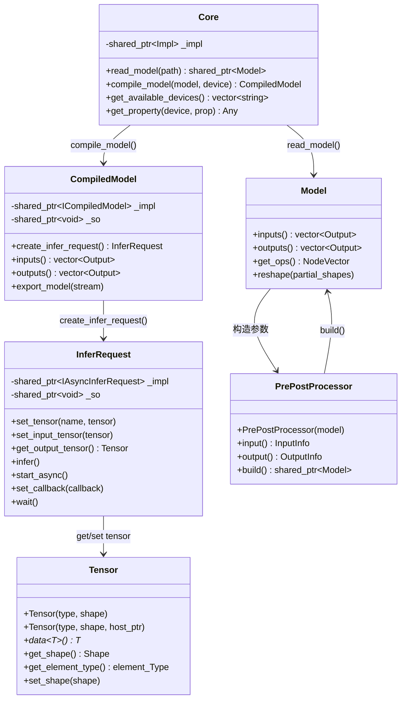

# OpenVINO 项目深度技术分析报告

## 目录

- [1. 项目概述](#1-项目概述)
  - [1.1 核心功能](#11-核心功能)
  - [1.2 应用场景](#12-应用场景)
  - [1.3 技术栈](#13-技术栈)
  - [1.4 整体模块划分](#14-整体模块划分)
- [2. 核心工作原理](#2-核心工作原理)
  - [2.1 推理流程总览](#21-推理流程总览)
  - [2.2 模型读取与解析](#22-模型读取与解析)
  - [2.3 预处理管线](#23-预处理管线)
  - [2.4 模型编译与设备适配](#24-模型编译与设备适配)
  - [2.5 推理执行与结果获取](#25-推理执行与结果获取)
- [3. Real-ESRGAN 超分辨率推理专项分析](#3-real-esrgan-超分辨率推理专项分析)
  - [3.1 分析背景与目标](#31-分析背景与目标)
  - [3.2 Real-ESRGAN 超分辨率推理完整调用链路](#32-real-esrgan-超分辨率推理完整调用链路)
  - [3.3 调用关系可视化](#33-调用关系可视化)
- [4. 关键技术细节](#4-关键技术细节)
  - [4.1 内存管理与零拷贝设计](#41-内存管理与零拷贝设计)
  - [4.2 异步推理与多线程](#42-异步推理与多线程)
  - [4.3 接口设计与 Pimpl 模式](#43-接口设计与-pimpl-模式)
  - [4.4 跨模块交互与插件体系](#44-跨模块交互与插件体系)
  - [4.5 异常处理机制](#45-异常处理机制)
  - [4.6 构建系统设计](#46-构建系统设计)
- [5. 总结与思考](#5-总结与思考)
  - [5.1 项目设计优势](#51-项目设计优势)
  - [5.2 项目设计不足](#52-项目设计不足)
  - [5.3 核心逻辑可优化点](#53-核心逻辑可优化点)
  - [5.4 Real-ESRGAN 推理调用设计思路](#54-real-esrgan-推理调用设计思路)

---

## 1. 项目概述

### 1.1 核心功能

OpenVINO（Open Visual Inference and Neural network Optimization）是由 Intel 开发的开源深度学习推理工具套件。其核心功能是将训练好的深度学习模型部署到各种 Intel 硬件（CPU、GPU、NPU 等）上进行高效推理，而无需重新训练模型。

核心能力包括：

- **多框架模型支持**：支持 ONNX、TensorFlow、TensorFlow Lite、PaddlePaddle、PyTorch、JAX 等主流深度学习框架的模型格式；
- **跨硬件推理**：统一 API 透明地运行在 CPU、集成/独立 GPU、NPU 等不同硬件加速器上；
- **自动优化**：通过图优化变换（Graph Transformations）、算子融合（Operator Fusion）、量化（Quantization）等技术自动提升推理性能；
- **预处理集成**：内置数据预处理管线（resize、颜色空间转换、layout 变换等），减少额外数据处理开销。

### 1.2 应用场景

| 场景 | 说明 |
|------|------|
| 边缘计算 | 在 IoT 设备、工业网关上部署轻量化推理 |
| 计算机视觉 | 图像分类、目标检测、语义分割、人脸识别 |
| 自然语言处理 | 文本分类、命名实体识别、机器翻译 |
| 医疗影像 | CT/MRI 图像分析、病灶检测 |
| 自动驾驶 | 传感器融合、障碍物检测、车道线识别 |
| 工业质检 | 缺陷检测、产品分类 |

### 1.3 技术栈

**C++ 核心技术：**

| 技术 | 用途 |
|------|------|
| C++17 标准 | 项目主体编译标准，使用 `std::filesystem`、`std::optional`、`std::string_view` 等现代特性 |
| 模板元编程 | 属性系统（`Property<T>`）、类型安全的张量访问 `Tensor::data<T>()` |
| 智能指针 | `std::shared_ptr` 管理 Model、Tensor、CompiledModel 等核心对象的生命周期 |
| Pimpl 模式 | Core、InferRequest、CompiledModel 均采用 Pimpl 隐藏实现细节，保证 ABI 稳定性 |
| 多线程 | `std::mutex`、`std::condition_variable` 实现异步推理回调机制 |
| CMake 构建系统 | 跨平台构建，宏 `ov_add_sample()` 统一示例编译流程 |

**其他技术栈：**

- Python 绑定（pybind11）
- C 语言绑定
- JavaScript 绑定（Node.js / napi）
- gflags（命令行参数解析）
- Protocol Buffers（TensorFlow 模型解析）

### 1.4 整体模块划分

```
openvino/
├── src/
│   ├── core/                  # 核心图表示层：ov::Model、Op、Shape、Tensor 基础定义
│   ├── inference/             # 推理引擎层：Core、CompiledModel、InferRequest
│   │   ├── include/openvino/runtime/  # 公共 API 头文件
│   │   ├── src/cpp/           # API 实现（core.cpp、infer_request.cpp 等）
│   │   ├── dev_api/           # 设备插件开发 API
│   │   └── tests/             # 推理引擎单元测试
│   ├── plugins/               # 硬件插件
│   │   ├── intel_cpu/         # CPU 插件
│   │   ├── intel_gpu/         # GPU 插件
│   │   ├── intel_npu/         # NPU 插件
│   │   ├── auto/              # AUTO 插件（自动设备选择）
│   │   └── hetero/            # HETERO 插件（跨设备异构执行）
│   ├── frontends/             # 前端解析器
│   │   ├── onnx/              # ONNX 模型前端
│   │   ├── tensorflow/        # TensorFlow 前端
│   │   ├── pytorch/           # PyTorch 前端
│   │   └── paddle/            # PaddlePaddle 前端
│   └── bindings/              # 多语言绑定
│       ├── python/            # Python API
│       ├── c/                 # C API
│       └── js/                # JavaScript API
├── samples/                   # 示例代码
│   ├── cpp/                   # C++ 示例（本报告重点分析对象）
│   ├── c/                     # C 示例
│   └── python/                # Python 示例
├── tools/                     # 开发工具（benchmark_tool、accuracy_checker 等）
├── thirdparty/                # 第三方依赖
├── docs/                      # 文档
└── tests/                     # 功能测试
```

---

## 2. 核心工作原理

### 2.1 推理流程总览

OpenVINO 的核心推理流程由以下五个阶段组成，每个阶段对应一个核心 C++ 类：

```
模型读取 → 预处理配置 → 模型编译 → 推理请求创建 → 执行推理
(Core)     (PrePostProcessor)  (Core)    (CompiledModel)   (InferRequest)
```

以 Real-ESRGAN 超分辨率推理为例，其核心调用序列如下：

```cpp
// Real-ESRGAN 超分辨率推理流程（基于 OpenVINO C++ API）

// Step 1: 初始化运行时核心
ov::Core core;

// Step 2: 读取 ONNX 模型（如 realesrgan-x4plus.onnx）
std::shared_ptr<ov::Model> model = core.read_model("realesrgan-x4plus.onnx");

// Step 3: 配置预处理 — 将 uint8 [0,255] 图像归一化到 float32 [0,1]
ov::preprocess::PrePostProcessor ppp(model);
ppp.input().tensor().set_element_type(ov::element::u8).set_layout("NHWC");
ppp.input().preprocess()
    .convert_element_type(ov::element::f32)   // u8 → f32
    .convert_layout("NCHW")                   // NHWC → NCHW
    .scale(255.0f);                           // [0,255] → [0,1]
ppp.output().tensor().set_element_type(ov::element::f32);
model = ppp.build();

// Step 4: 编译模型到设备
ov::CompiledModel compiled_model = core.compile_model(model, "CPU");

// Step 5: 创建推理请求
ov::InferRequest infer_request = compiled_model.create_infer_request();

// Step 6: 设置输入张量（低分辨率图像）
ov::Tensor input_tensor(ov::element::u8, {1, height, width, 3}, image_data.get());
infer_request.set_input_tensor(input_tensor);

// Step 7: 执行同步推理
infer_request.infer();

// Step 8: 获取输出张量（4 倍超分辨率图像）
const ov::Tensor& output_tensor = infer_request.get_output_tensor();
// 输出形状: {1, 3, height*4, width*4}，值域 [0,1]
```

**设计理由：** 将推理过程拆分为多个明确阶段，使得每个阶段都可以独立配置和优化。例如，预处理在模型编译之前完成，可以被融合到计算图中以减少运行时开销；模型编译将通用的模型表示转化为设备特定的优化表示，只需执行一次。Real-ESRGAN 模型的输入输出均为图像张量（而非分类标签），因此后处理阶段需将 float32 输出反归一化为像素值并保存为高分辨率图像文件。

### 2.2 模型读取与解析

`Core::read_model()` 是模型加载的入口函数，支持多种格式的模型文件：

```cpp
// 文件: src/inference/src/cpp/core.cpp, 第 80-84 行
std::shared_ptr<ov::Model> Core::read_model(const std::filesystem::path& model_path,
                                            const std::filesystem::path& bin_path,
                                            const ov::AnyMap& properties) const {
    OV_ITT_SCOPED_REGION_BASE(ov::itt::domains::OV, "Read model");
    OV_CORE_CALL_STATEMENT(return _impl->read_model(model_path, bin_path, properties););
}
```

**关键数据流：**

1. `Core::read_model()` 接收模型文件路径（.xml/.onnx/.pb/.pdmodel/.tflite 等）；
2. 内部委托给 `CoreImpl::read_model()`，根据文件扩展名选择对应的前端解析器（Frontend）；
3. 前端解析器将模型文件解析为统一的 `ov::Model` 图表示；
4. `ov::Model` 是一个有向无环图（DAG），节点为算子（`ov::Node`），边为张量连接。

**返回值：** `std::shared_ptr<ov::Model>` — 使用共享指针管理模型生命周期，允许多处引用同一模型，当最后一个引用释放时自动销毁。

### 2.3 预处理管线

OpenVINO 通过 `PrePostProcessor` 类提供声明式的预处理配置，将数据转换逻辑嵌入到计算图中。以 Real-ESRGAN 超分辨率模型的预处理为例：

```cpp
// Real-ESRGAN 预处理配置示例

ov::preprocess::PrePostProcessor ppp(model);  // 绑定到已读取的模型

// 配置输入张量信息：数据类型 u8、布局 NHWC（来自图像读取器的原始格式）
ppp.input().tensor()
    .set_element_type(ov::element::u8)        // 输入精度 (uint8, [0,255])
    .set_layout("NHWC");                      // 输入布局 (Height-Width-Channels)

// 添加预处理步骤：类型转换 + 布局转换 + 归一化
ppp.input().preprocess()
    .convert_element_type(ov::element::f32)   // u8 → f32
    .convert_layout("NCHW")                   // NHWC → NCHW（模型期望的布局）
    .scale(255.0f);                           // [0,255] → [0,1] 归一化

// 声明模型期望的布局
ppp.input().model().set_layout("NCHW");

// 设置输出精度
ppp.output().tensor().set_element_type(ov::element::f32);

// 构建：将预处理步骤插入计算图
model = ppp.build();
```

**Real-ESRGAN 与分类模型预处理差异：**

与图像分类模型（如 ResNet）不同，Real-ESRGAN 的预处理有以下特点：
- **无 resize 操作**：超分辨率模型需要处理原始分辨率输入，resize 会破坏低分辨率纹理信息；
- **简单归一化**：仅需 `scale(255.0f)` 将 [0,255] 映射到 [0,1]，无需 ImageNet 均值/方差归一化；
- **输出后处理**：推理输出为 [0,1] 范围的 float32 张量，需要乘以 255 并裁剪到 [0,255] 后保存为图像。

**设计优势：**

1. **声明式 API**：用户只需声明输入/输出的格式，框架自动推导需要的转换步骤；
2. **图融合**：`ppp.build()` 将 resize、layout 转换、类型转换等操作作为算子节点插入到模型图中，编译时可被融合到后续计算节点中，避免独立的预处理开销；
3. **零额外内存**：预处理操作在推理引擎内部执行，不需要用户分配额外的中间缓冲区。

### 2.4 模型编译与设备适配

`Core::compile_model()` 是性能优化的核心环节：

```cpp
// 文件: src/inference/src/cpp/core.cpp, 第 113-120 行
CompiledModel Core::compile_model(const std::shared_ptr<const ov::Model>& model,
                                  const std::string& device_name,
                                  const AnyMap& config) {
    OV_ITT_SCOPED_REGION_BASE(ov::itt::domains::Phases, "Compile model");
    OV_CORE_CALL_STATEMENT({
        auto exec = _impl->compile_model(model, device_name, config);
        return {exec._ptr, exec._so};
    });
}
```

**编译过程内部步骤：**

1. **设备解析**：根据 `device_name`（如 `"CPU"`、`"GPU"`）查找对应的设备插件；
2. **图优化变换**：应用一系列图优化 Pass（常量折叠、算子融合、内存优化等）；
3. **算子映射**：将通用算子映射为设备特定的计算核心（kernel）；
4. **内存规划**：为中间张量分配最优的内存布局和缓冲区复用策略；
5. **返回值**：`CompiledModel` 对象，包含已优化的可执行模型。

**关键设计：** `CompiledModel` 对象通过 `std::shared_ptr<void> _so` 持有对插件动态库的引用，确保在 `CompiledModel` 生命周期内插件库不会被卸载——这是跨模块资源管理的关键安全机制。

### 2.5 推理执行与结果获取

推理执行通过 `InferRequest` 对象完成，支持同步和异步两种模式：

**同步推理：**

```cpp
// 文件: src/inference/src/cpp/infer_request.cpp, 第 66-81 行

// 设置张量
void InferRequest::set_tensor(const std::string& name, const Tensor& tensor) {
    OV_INFER_REQ_CALL_STATEMENT({
        ov::Output<const ov::Node> port;
        OPENVINO_ASSERT(::getPort(port, name, {_impl->get_inputs(), _impl->get_outputs()}),
                        "Port for tensor name " + name + " was not found.");
        set_tensor(port, tensor);
    });
}
```

内部通过 `getPort()` 辅助函数查找与名称匹配的模型端口（遍历输入和输出端口列表，按名称集合匹配），然后调用底层 `IAsyncInferRequest::set_tensor()` 将张量数据绑定到对应端口。

**异步推理（回调模式）：**

OpenVINO 支持异步推理模式，在 Real-ESRGAN 等高计算量场景中尤为有价值。异步模式允许 CPU 在等待设备计算的同时准备下一批数据：

```cpp
// 异步推理示例（可应用于 Real-ESRGAN 分块推理场景）

// 设置异步回调
infer_request.set_callback([&](std::exception_ptr ex) {
    std::lock_guard<std::mutex> l(mutex);  // 线程安全
    if (ex) {
        exception_var = ex;
        condVar.notify_all();
        return;
    }
    // 处理当前 tile 的输出，准备下一个 tile
    condVar.notify_one();
});

infer_request.start_async();  // 启动异步推理

// 主线程等待
std::unique_lock<std::mutex> lock(mutex);
condVar.wait(lock, [&] {
    if (exception_var) std::rethrow_exception(exception_var);
    return finished;
});
```

**设计理由：** 异步推理允许 CPU 在等待设备计算的同时执行其他工作（如准备下一批输入数据），最大化硬件利用率。回调机制配合条件变量实现了高效的同步等待，避免忙轮询浪费 CPU 资源。

---

## 3. Real-ESRGAN 超分辨率推理专项分析

### 3.1 分析背景与目标

本章以 Real-ESRGAN（Real-Enhanced Super-Resolution Generative Adversarial Network）为例，展示如何使用 OpenVINO C++ API 实现图像超分辨率推理的完整调用链路分析。Real-ESRGAN 是一种面向真实世界图像退化场景的超分辨率模型，能够将低分辨率图像放大 4 倍（或 2 倍），同时恢复纹理细节并抑制伪影。

> **注：** OpenVINO 仓库 `samples/cpp/` 目录中未包含独立的 Real-ESRGAN 示例。本章基于 OpenVINO C++ API 构建完整的 Real-ESRGAN 推理代码（示例代码为演示性质），聚焦于超分辨率任务对推理管线各阶段（模型加载、预处理、编译、推理、后处理）的具体使用方式。

### 3.2 Real-ESRGAN 超分辨率推理完整调用链路

#### 3.2.1 Real-ESRGAN 模型特征

| 属性 | 说明 |
|------|------|
| 模型格式 | ONNX（从 PyTorch 导出，如 `realesrgan-x4plus.onnx`） |
| 输入 | `[1, 3, H, W]`，float32，值域 [0, 1]，RGB 通道顺序 |
| 输出 | `[1, 3, H×4, W×4]`，float32，值域约 [0, 1] |
| 核心结构 | RRDB（Residual-in-Residual Dense Block）+ 上采样（PixelShuffle） |
| 典型参数量 | ~16.7M（x4plus 版本） |

#### 3.2.2 完整 C++ 推理代码

```cpp
// real_esrgan_inference.cpp — Real-ESRGAN 超分辨率推理示例
// 基于 OpenVINO C++ Runtime API
// 注：此为演示代码，展示 API 调用流程。实际项目中图像读写建议使用 OpenCV。

#include <algorithm>
#include <fstream>
#include <iostream>
#include <memory>
#include <string>
#include <vector>

#include "openvino/openvino.hpp"  // 包含 Core, Tensor, PrePostProcessor, OPENVINO_ASSERT 等全部 API

// 使用 OpenCV 进行图像读写（实际项目依赖）
#include <opencv2/opencv.hpp>

int main(int argc, char* argv[]) {
    try {
        // -------- 参数校验 --------
        if (argc != 4) {
            std::cerr << "Usage: " << argv[0]
                      << " <path_to_onnx_model> <input_image> <device_name>" << std::endl;
            return EXIT_FAILURE;
        }
        const std::string model_path = argv[1];   // e.g., "realesrgan-x4plus.onnx"
        const std::string image_path = argv[2];    // 低分辨率输入图像
        const std::string device_name = argv[3];   // e.g., "CPU" 或 "GPU"

        // -------- Step 1. 初始化 OpenVINO Runtime Core --------
        ov::Core core;
        std::cout << ov::get_openvino_version() << std::endl;

        // -------- Step 2. 读取 ONNX 模型 --------
        // Real-ESRGAN 通常以 ONNX 格式分发，core.read_model() 内部
        // 调用 ONNX Frontend 将 .onnx 解析为 ov::Model 计算图
        std::shared_ptr<ov::Model> model = core.read_model(model_path);

        // 验证模型输入输出
        OPENVINO_ASSERT(model->inputs().size() == 1,
                        "Real-ESRGAN model should have exactly 1 input");
        OPENVINO_ASSERT(model->outputs().size() == 1,
                        "Real-ESRGAN model should have exactly 1 output");

        // 打印模型信息
        auto input_shape = model->input().get_shape();    // e.g., {1, 3, 256, 256}
        auto output_shape = model->output().get_shape();   // e.g., {1, 3, 1024, 1024}
        std::cout << "Model input shape: " << input_shape << std::endl;
        std::cout << "Model output shape: " << output_shape << std::endl;

        // -------- Step 3. 读取输入图像 --------
        // 使用 OpenCV 加载图像为 RGB uint8 格式
        cv::Mat bgr_image = cv::imread(image_path, cv::IMREAD_COLOR);
        if (bgr_image.empty()) {
            throw std::logic_error("Failed to read image: " + image_path);
        }
        cv::Mat rgb_image;
        cv::cvtColor(bgr_image, rgb_image, cv::COLOR_BGR2RGB);  // OpenCV 默认 BGR → RGB

        size_t img_h = static_cast<size_t>(rgb_image.rows);
        size_t img_w = static_cast<size_t>(rgb_image.cols);

        // -------- Step 4. 配置预处理 --------
        // Real-ESRGAN 输入要求：float32, NCHW 布局, [0,1] 归一化
        ov::preprocess::PrePostProcessor ppp(model);

        // 4a) 声明输入张量的实际格式（来自图像读取器）
        ppp.input().tensor()
            .set_element_type(ov::element::u8)    // 图像像素为 uint8 [0,255]
            .set_layout("NHWC");                  // 图像数据布局: Height × Width × Channels

        // 4b) 添加预处理步骤
        ppp.input().preprocess()
            .convert_element_type(ov::element::f32)  // uint8 → float32
            .convert_layout("NCHW")                  // NHWC → NCHW
            .scale(255.0f);                          // [0,255] → [0,1] 归一化

        // 4c) 声明模型期望的输入格式
        ppp.input().model().set_layout("NCHW");

        // 4d) 声明输出精度
        ppp.output().tensor().set_element_type(ov::element::f32);

        // 4e) 构建预处理管线，将转换步骤插入模型计算图
        model = ppp.build();

        // -------- Step 5. 编译模型到目标设备 --------
        // compile_model() 执行：图优化 → 算子融合 → 设备特定 kernel 映射
        ov::CompiledModel compiled_model = core.compile_model(model, device_name);

        // -------- Step 6. 创建推理请求 --------
        ov::InferRequest infer_request = compiled_model.create_infer_request();

        // -------- Step 7. 准备输入张量 --------
        // 使用零拷贝方式包装 OpenCV Mat 内存（rgb_image 必须在推理期间保持有效）
        ov::Tensor input_tensor(ov::element::u8,
                                {1, img_h, img_w, 3},
                                rgb_image.data);
        infer_request.set_input_tensor(input_tensor);

        // -------- Step 8. 执行同步推理 --------
        std::cout << "Running Real-ESRGAN inference..." << std::endl;
        infer_request.infer();  // 同步阻塞，直到推理完成

        // -------- Step 9. 获取输出并后处理 --------
        const ov::Tensor& output_tensor = infer_request.get_output_tensor();
        const float* output_data = output_tensor.data<float>();
        ov::Shape out_shape = output_tensor.get_shape();
        // out_shape = {1, 3, H*4, W*4}

        size_t out_h = out_shape[2];  // 超分辨率后的高度
        size_t out_w = out_shape[3];  // 超分辨率后的宽度
        size_t out_c = out_shape[1];  // 通道数 (3)

        std::cout << "Output resolution: " << out_w << "x" << out_h << std::endl;

        // 反归一化：float32 [0,1] → uint8 [0,255]，NCHW → NHWC
        std::vector<uint8_t> output_image(out_h * out_w * out_c);
        for (size_t c = 0; c < out_c; ++c) {
            for (size_t h = 0; h < out_h; ++h) {
                for (size_t w = 0; w < out_w; ++w) {
                    float val = output_data[c * out_h * out_w + h * out_w + w];
                    val = std::clamp(val * 255.0f, 0.0f, 255.0f);  // 裁剪到 [0,255]
                    output_image[(h * out_w + w) * out_c + c] = static_cast<uint8_t>(val);
                }
            }
        }

        // 保存高分辨率图像
        // 注意：output_image 为 RGB 排列，OpenCV 需要 BGR 格式
        cv::Mat out_mat(static_cast<int>(out_h), static_cast<int>(out_w),
                        CV_8UC3, output_image.data());
        cv::Mat bgr_output;
        cv::cvtColor(out_mat, bgr_output, cv::COLOR_RGB2BGR);
        cv::imwrite("output_sr.png", bgr_output);

        std::cout << "Super-resolution complete. Output saved: output_sr.png ("
                  << out_w << "x" << out_h << " pixels)." << std::endl;

    } catch (const std::exception& ex) {
        std::cerr << "Error: " << ex.what() << std::endl;
        return EXIT_FAILURE;
    }

    return EXIT_SUCCESS;
}
```

#### 3.2.3 完整调用链路（函数级）

| 步骤 | 调用函数 | 输入 | 输出 | 依赖 |
|------|---------|------|------|------|
| 1 | `ov::get_openvino_version()` | 无 | 版本字符串 | openvino core |
| 2 | `ov::Core core` 构造函数 | 空（使用默认 plugins.xml） | Core 实例 | CoreImpl, plugins.xml |
| 3 | `core.read_model(model_path)` | ONNX 模型路径 | `shared_ptr<Model>` | ONNX Frontend |
| 4 | `model->input().get_shape()` | 无 | Shape（如 {1,3,256,256}） | ov::Model |
| 5 | `ov::preprocess::PrePostProcessor ppp(model)` | Model 共享指针 | PPP 实例 | PrePostProcessor |
| 6 | `ppp.input().tensor().set_element_type(u8).set_layout("NHWC")` | 类型、布局 | PPP 引用（链式） | PrePostProcessor |
| 7 | `ppp.input().preprocess().convert_element_type(f32).convert_layout("NCHW").scale(255.0f)` | 转换参数 | PPP 引用 | PrePostProcessor |
| 8 | `ppp.input().model().set_layout("NCHW")` | 布局字符串 | PPP 引用 | PrePostProcessor |
| 9 | `ppp.output().tensor().set_element_type(f32)` | 数据类型 | PPP 引用 | PrePostProcessor |
| 10 | `ppp.build()` | 无 | 新 `shared_ptr<Model>`（含预处理节点） | PrePostProcessor |
| 11 | `core.compile_model(model, device_name)` | Model、设备名 | CompiledModel | 设备插件 |
| 12 | `compiled_model.create_infer_request()` | 无 | InferRequest | CompiledModel |
| 13 | `ov::Tensor(u8, shape, host_ptr)` | 类型、形状、数据指针 | Tensor（零拷贝包装） | ov::Tensor |
| 14 | `infer_request.set_input_tensor(input_tensor)` | Tensor | void | InferRequest |
| 15 | `infer_request.infer()` | 无 | void（同步阻塞） | 设备后端 |
| 16 | `infer_request.get_output_tensor()` | 无 | `const Tensor&`（超分图像） | InferRequest |
| 17 | `output_tensor.data<float>()` | 无 | `float*`（NCHW [0,1]） | ov::Tensor |
| 18 | 后处理循环：`clamp(val * 255)`, NCHW→NHWC | float 数据 | `vector<uint8_t>` 图像 | 用户代码 |

#### 3.2.4 超分辨率推理与分类推理的关键差异

| 维度 | 分类推理（如 ResNet） | Real-ESRGAN 超分辨率推理 |
|------|---------------------|------------------|
| 任务类型 | 图像分类（输出类别标签） | 图像超分辨率（输出高分辨率图像） |
| 预处理 resize | 需要 resize 到模型固定输入尺寸 | **不 resize**（保持原始分辨率） |
| 归一化方式 | 隐式（由模型内部处理） | 显式 `scale(255.0f)` 到 [0,1] |
| 输出处理 | 取 argmax 得分类索引 | 反归一化 + NCHW→NHWC 布局转换 + 保存图像 |
| 输出张量形状 | `{1, num_classes}` | `{1, 3, H*4, W*4}`（与输入同类型） |
| 依赖外部库 | 内置 format_reader 即可 | 推荐 OpenCV（cv::imread/imwrite） |
| 计算量 | 轻量（ResNet ~25M params） | 重量（Real-ESRGAN ~16.7M params, 大量逐像素计算） |

#### 3.2.5 Real-ESRGAN 推理关键技术要点

**1. ONNX 模型加载**

Real-ESRGAN 原始实现基于 PyTorch，通过 `torch.onnx.export()` 导出为 ONNX 格式。OpenVINO 的 `core.read_model()` 内部调用 ONNX Frontend 解析模型：

```cpp
// 文件: src/inference/src/cpp/core.cpp, 第 80-84 行
std::shared_ptr<ov::Model> Core::read_model(const std::filesystem::path& model_path,
                                            const std::filesystem::path& bin_path,
                                            const ov::AnyMap& properties) const {
    OV_ITT_SCOPED_REGION_BASE(ov::itt::domains::OV, "Read model");
    OV_CORE_CALL_STATEMENT(return _impl->read_model(model_path, bin_path, properties););
}
```

ONNX Frontend 将 `Conv`、`BatchNormalization`、`LeakyReLU`、`PixelShuffle`（对应 ONNX 的 `Reshape` + `Transpose`）等 ONNX 算子转换为 OpenVINO 内部的 `ov::Node` 图表示。

**2. 超分辨率输出的后处理**

与分类任务仅需读取 softmax 概率不同，超分辨率任务的输出是一个完整的图像张量。后处理需要：
- **反归一化**：`pixel = clamp(output_value * 255.0, 0.0, 255.0)`
- **布局转换**：从模型输出的 NCHW 转换为图像存储的 NHWC（Height×Width×Channels）
- **类型转换**：float32 → uint8

```cpp
// 后处理：NCHW float32 [0,1] → NHWC uint8 [0,255]
for (size_t c = 0; c < out_c; ++c) {
    for (size_t h = 0; h < out_h; ++h) {
        for (size_t w = 0; w < out_w; ++w) {
            float val = output_data[c * out_h * out_w + h * out_w + w];
            val = std::clamp(val * 255.0f, 0.0f, 255.0f);
            output_image[(h * out_w + w) * out_c + c] = static_cast<uint8_t>(val);
        }
    }
}
```

**3. 大尺寸图像的分块推理策略**

Real-ESRGAN 对显存/内存需求敏感。对于大尺寸输入图像（如 1920×1080），可以采用分块（tiling）策略：
- 将输入图像划分为重叠的小块（如 256×256，overlap=32）；
- 对每个小块独立执行推理；
- 将输出块拼合（blend 重叠区域）得到完整的超分辨率图像；
- OpenVINO 的 `model->reshape()` API 可用于动态调整输入尺寸以适配不同的 tile 大小。

**异常处理：** 整个流程包裹在 `try-catch` 块中，捕获 `std::exception` 并输出到 `std::cerr`，返回 `EXIT_FAILURE`。常见异常场景包括：模型格式不兼容（ONNX opset 版本过新）、设备不可用、内存不足（大尺寸图像）等。


### 3.3 调用关系可视化

#### 3.3.1 Real-ESRGAN 推理流程



#### 3.3.2 类依赖关系



---

## 4. 关键技术细节

### 4.1 内存管理与零拷贝设计

OpenVINO 在张量管理上提供了两种内存模式：

**模式 1：框架分配内存**

```cpp
ov::Tensor tensor(ov::element::f32, {1, 3, 224, 224});  // 框架内部分配缓冲区
float* data = tensor.data<float>();                       // 获取内部指针
```

**模式 2：零拷贝包装外部内存**

```cpp
// Real-ESRGAN 推理示例中的零拷贝张量创建
// 直接包装 OpenCV Mat 内存，不分配新缓冲区
ov::Tensor input_tensor(ov::element::u8,
                        {1, img_h, img_w, 3},
                        rgb_image.data);
```

零拷贝设计的核心价值：在图像处理场景中，图像数据通常由外部库（如 OpenCV）分配并填充。如果推理引擎需要再拷贝一份到自己的缓冲区，会浪费内存带宽，尤其在 Real-ESRGAN 等超分辨率场景下处理高分辨率图像时影响显著。

**生命周期管理要点：** 使用零拷贝模式时，用户必须确保外部内存在 `InferRequest::infer()` 或 `start_async()` 完成之前保持有效。在 Real-ESRGAN 示例中，`rgb_image`（`cv::Mat`）的生命周期覆盖了整个 `try` 块，因此安全。

### 4.2 异步推理与多线程

异步推理的线程模型：

```
主线程                              推理引擎工作线程
  |                                      |
  |-- start_async() ------------------>  |
  |                                      |-- 执行推理计算
  |-- 可做其他工作（准备下一批数据）       |
  |                                      |-- 推理完成
  |  <-- callback() 在工作线程中调用 --  |
  |                                      |
  |-- condVar.wait() ----------------->  |
  |                                      |
```

**线程安全关键点（异步推理通用模式）：**

```cpp
// 异步推理的线程同步原语
std::condition_variable condVar;
std::mutex mutex;
std::exception_ptr exception_var;  // 跨线程传递异常
```

- `mutex` 保护共享状态变量和 `exception_var`（异常指针）；
- 回调函数使用 `std::lock_guard` 加锁后修改共享状态；
- 主线程使用 `condVar.wait()` 配合谓词等待，避免虚假唤醒（spurious wakeup）。

### 4.3 接口设计与 Pimpl 模式

OpenVINO 的所有核心公共类均采用 Pimpl（Pointer to Implementation）模式：

```cpp
// 文件: src/inference/include/openvino/runtime/core.hpp, 第 37-39 行
class OPENVINO_RUNTIME_API Core {
    class Impl;
    std::shared_ptr<Impl> _impl;
    // ...
};

// 文件: src/inference/include/openvino/runtime/infer_request.hpp, 第 31-33 行
class OPENVINO_RUNTIME_API InferRequest {
    std::shared_ptr<ov::IAsyncInferRequest> _impl;
    std::shared_ptr<void> _so;
    // ...
};

// 文件: src/inference/include/openvino/runtime/compiled_model.hpp, 第 36-38 行
class OPENVINO_RUNTIME_API CompiledModel {
    std::shared_ptr<ov::ICompiledModel> _impl;
    std::shared_ptr<void> _so;
    // ...
};
```

**设计理由：**

1. **ABI 稳定性**：公共头文件中只暴露指针，实现类的变更不会影响公共 API 的二进制兼容性；
2. **编译隔离**：用户代码不需要包含实现类的头文件，减少编译依赖和编译时间；
3. **插件生命周期管理**：`_so`（`shared_ptr<void>`）持有对动态库的引用。当 `CompiledModel` 或 `InferRequest` 被销毁时，先释放 `_impl`（实现对象），再释放 `_so`（库引用），确保正确的卸载顺序。

**析构顺序保证：**

```cpp
// 文件: src/inference/include/openvino/runtime/infer_request.hpp, 第 77-81 行
// 注释: 为了在默认生成的赋值运算符中保持销毁顺序，
// _impl 存储在 _so 之前
~InferRequest();

// 文件: src/inference/src/cpp/infer_request.cpp, 第 56-58 行
InferRequest::~InferRequest() {
    _impl = {};  // 先释放实现对象
}
// _so 随后由编译器生成的析构逻辑释放
```

### 4.4 跨模块交互与插件体系

OpenVINO 采用插件架构实现硬件抽象：

```
┌─────────────────────────────────────────────────┐
│                  用户应用代码                      │
│       (Real-ESRGAN 推理 / samples/cpp/*)            │
├─────────────────────────────────────────────────┤
│               OpenVINO Runtime API                │
│    (ov::Core, ov::CompiledModel, ov::InferRequest) │
├─────────────────────────────────────────────────┤
│              CoreImpl (插件管理器)                  │
│   ┌──────────┬──────────┬──────────┬──────────┐   │
│   │ CPU 插件  │ GPU 插件  │ NPU 插件  │ AUTO 插件 │   │
│   │(libcpu.so)│(libgpu.so)│(libnpu.so)│(libauto.so)│   │
│   └──────────┴──────────┴──────────┴──────────┘   │
├─────────────────────────────────────────────────┤
│                    硬件层                          │
│           Intel CPU / GPU / NPU / ...              │
└─────────────────────────────────────────────────┘
```

**插件注册机制：**

```cpp
// 文件: src/inference/src/cpp/core.cpp, 第 67-74 行
Core::Core(const std::filesystem::path& xml_config_file) : _impl(std::make_shared<Impl>()) {
    if (const auto xml_path = find_plugins_xml(xml_config_file); !xml_path.empty()) {
        // 从 XML 配置文件注册插件（动态库构建）
        OV_CORE_CALL_STATEMENT(_impl->register_plugins_in_registry(xml_path, xml_config_file.empty());)
    }
    // 从编译时预定义列表注册插件（静态库构建）
    OV_CORE_CALL_STATEMENT(_impl->register_compile_time_plugins();)
}
```

**插件查找策略（`find_plugins_xml()`）：**

```cpp
// 文件: src/inference/src/cpp/core.cpp, 第 19-47 行
std::filesystem::path find_plugins_xml(const std::filesystem::path& xml_file) {
    // 搜索优先级：
    // 1. 用户指定的绝对/相对路径
    // 2. libopenvino.so 同目录下的 openvino-X.Y.Z/plugins.xml
    // 3. libopenvino.so 同目录下的 plugins.xml
    // ...
}
```

### 4.5 异常处理机制

OpenVINO 采用宏封装的统一异常处理模式：

**Core 层异常宏：**

```cpp
// 文件: src/inference/src/cpp/core.cpp, 第 51-58 行
#define OV_CORE_CALL_STATEMENT(...)             \
    try {                                       \
        __VA_ARGS__;                            \
    } catch (const std::exception& ex) {        \
        OPENVINO_THROW(ex.what());              \
    } catch (...) {                             \
        OPENVINO_THROW("Unexpected exception"); \
    }
```

**InferRequest 层异常宏（增加 Busy/Cancelled 异常透传）：**

```cpp
// 文件: src/inference/src/cpp/infer_request.cpp, 第 21-33 行
#define OV_INFER_REQ_CALL_STATEMENT(...)                                    \
    OPENVINO_ASSERT(_impl != nullptr, "InferRequest was not initialized."); \
    try {                                                                   \
        __VA_ARGS__;                                                        \
    } catch (const ov::Busy&) {                                             \
        throw;                                                              \
    } catch (const ov::Cancelled&) {                                        \
        throw;                                                              \
    } catch (const std::exception& ex) {                                    \
        OPENVINO_THROW(ex.what());                                          \
    } catch (...) {                                                         \
        OPENVINO_THROW("Unexpected exception");                             \
    }
```

**设计要点：**

1. 所有公共 API 方法都通过宏包裹，确保内部异常不会泄漏到用户代码——所有异常统一转换为 `ov::Exception`（继承自 `std::exception`）；
2. `ov::Busy` 和 `ov::Cancelled` 是需要透传的特殊异常：`Busy` 表示推理请求正忙（异步场景），`Cancelled` 表示推理被取消，这些异常有明确的语义，用户代码需要直接处理；
3. 在 `InferRequest` 的宏中额外添加了 `_impl != nullptr` 断言，防止在未初始化的对象上调用方法。

**示例层异常处理（所有示例通用模式）：**

```cpp
// 统一的异常捕获模式（Real-ESRGAN 推理示例同理）
} catch (const std::exception& ex) {
    std::cerr << ex.what() << std::endl;
    return EXIT_FAILURE;
}
```

### 4.6 构建系统设计

**核心宏 `ov_add_sample()`：**

```cmake
# 文件: samples/cpp/CMakeLists.txt, 第 174-248 行
macro(ov_add_sample)
    set(options EXCLUDE_CLANG_FORMAT)
    set(oneValueArgs NAME)
    set(multiValueArgs SOURCES HEADERS DEPENDENCIES INCLUDE_DIRECTORIES)
    cmake_parse_arguments(SAMPLE "${options}" "${oneValueArgs}" "${multiValueArgs}" ${ARGN})

    # 创建可执行目标
    add_executable(${SAMPLE_NAME} ${SAMPLE_SOURCES} ${SAMPLE_HEADERS})

    # 查找并链接 OpenVINO Runtime
    find_package(OpenVINO REQUIRED COMPONENTS Runtime)
    set(ov_link_libraries openvino::runtime)

    # 链接依赖
    target_link_libraries(${SAMPLE_NAME} PRIVATE ${ov_link_libraries} Threads::Threads ${SAMPLE_DEPENDENCIES})

    # 安装到 samples_bin/
    install(TARGETS ${SAMPLE_NAME} RUNTIME DESTINATION samples_bin/ COMPONENT samples_bin EXCLUDE_FROM_ALL)
endmacro()
```

**使用示例（Real-ESRGAN 推理的 CMake 构建配置）：**

```cmake
# 假设为 Real-ESRGAN 推理示例构建
ov_add_sample(NAME real_esrgan_inference
              SOURCES "${CMAKE_CURRENT_SOURCE_DIR}/main.cpp"
              DEPENDENCIES opencv_core opencv_imgcodecs opencv_imgproc)
```

**设计优势：**

1. **标准化**：所有示例使用同一个宏构建，确保编译选项、链接库、安装路径的一致性；
2. **依赖声明**：通过 `DEPENDENCIES` 参数显式声明依赖的辅助库（`format_reader`、`ie_samples_utils`、`gflags`）；
3. **独立构建**：通过 `build_samples.sh` 脚本可以独立于 OpenVINO 主项目构建示例，只需安装好 OpenVINO Runtime；
4. **C++17 标准**：在 `CMakeLists.txt` 第 104 行设置 `CMAKE_CXX_STANDARD 17`。

---

## 5. 总结与思考

### 5.1 项目设计优势

**1. 层次化的 API 设计**

OpenVINO 将推理流程分为 `Core → Model → PrePostProcessor → CompiledModel → InferRequest → Tensor` 六个层次清晰的抽象，每个类职责单一：
- `Core` 管理插件和模型加载；
- `Model` 表示设备无关的计算图；
- `PrePostProcessor` 封装数据预处理逻辑；
- `CompiledModel` 表示设备特定的优化模型；
- `InferRequest` 管理单次推理的执行状态；
- `Tensor` 管理数据缓冲区。

**2. Pimpl 模式保证 ABI 稳定性**

所有公共类使用 `std::shared_ptr<Impl>` 隐藏实现，使得内部优化和重构不会破坏用户代码的二进制兼容性。这对于作为共享库分发的推理引擎至关重要。

**3. 声明式预处理管线**

`PrePostProcessor` 的 Builder 模式设计（链式调用 `.set_element_type().set_layout().set_shape()`）使预处理配置既简洁又类型安全。更关键的是，`build()` 将预处理步骤转化为计算图节点，使得编译器可以将其与后续计算融合。

**4. 统一的多硬件抽象**

通过插件体系，用户代码只需修改 `device_name` 字符串（`"CPU"` → `"GPU"`）即可切换运行设备，无需任何代码逻辑变更。

**5. 零拷贝张量与灵活的内存管理**

`ov::Tensor` 同时支持框架托管内存和用户外部内存两种模式，在性能敏感场景中减少不必要的数据拷贝。

### 5.2 项目设计不足

**1. 异常处理粒度不足**

Real-ESRGAN 推理示例中仅捕获 `std::exception` 并打印到 `stderr`，缺乏分类处理（如区分模型格式错误、设备不可用、内存不足等场景），不利于实际生产环境的错误诊断。

**2. 编译时间较长**

由于大量使用模板元编程（属性系统、类型安全张量访问），加之项目规模庞大（数百万行代码），完整编译耗时较长，增加开发迭代成本。

**3. 大尺寸图像推理的内存管理**

Real-ESRGAN 等超分辨率模型处理大尺寸图像时，显存/内存消耗可能超出设备限制。OpenVINO 当前缺乏内置的分块推理（tiling）支持，需要用户在应用层手动实现分块、重叠和拼合逻辑。

### 5.3 核心逻辑可优化点

**1. 预处理管线的运行时编译**

当前 `PrePostProcessor::build()` 在每次调用时重新构建预处理子图。对于 Real-ESRGAN 分块推理等重复使用相同预处理配置的场景，可以缓存已构建的子图以避免重复开销。

**2. 异步推理的错误恢复**

异步推理链在异常发生时直接退出，缺乏重试或降级机制。在 Real-ESRGAN 生产部署中，可以增加：
- 可配置的重试策略（如 ONNX opset 不兼容时自动降级）；
- 异常计数与断路器模式；
- 回退到同步推理的降级方案。

**3. 分块推理的内存管理优化**

Real-ESRGAN 处理大尺寸图像时需要分块推理，当前每个 tile 的输入/输出张量需要重新分配和拷贝。可以考虑：
- 使用内存池预分配固定大小的 tile 缓冲区；
- 利用 `model->reshape()` 动态调整输入尺寸以适配不同 tile 大小；
- 通过异步推理重叠 tile 预处理和推理计算。

### 5.4 Real-ESRGAN 推理调用设计思路

**端到端推理管线设计：**

Real-ESRGAN 推理展示了 OpenVINO C++ API 在超分辨率场景下的典型使用模式：

```
图像读取 (OpenCV)  →  Core 初始化  →  ONNX 模型加载
  ↓
PrePostProcessor 配置  →  u8→f32 + NHWC→NCHW + scale(÷255)
  ↓
模型编译到设备  →  创建推理请求
  ↓
零拷贝输入张量  →  同步推理  →  输出张量获取
  ↓
后处理: 反归一化 + NCHW→NHWC + clamp  →  保存高分辨率图像
```

**关键设计决策：**

1. **零拷贝输入**：直接包装 `cv::Mat` 内存作为 `ov::Tensor`，避免图像数据拷贝，在高分辨率场景下尤为重要；
2. **PrePostProcessor 融合**：将归一化（`scale(255.0f)`）和布局转换（NHWC→NCHW）嵌入计算图，编译时可被优化器融合到后续计算中；
3. **同步推理**：超分辨率任务通常单图处理且计算量大，同步模式简化了代码逻辑；异步模式可用于分块推理场景以重叠 I/O 和计算。

**代码组织：**

Real-ESRGAN 推理代码遵循 OpenVINO 标准模板：参数解析 → Core 初始化 → 模型加载 → 预处理 → 编译 → 推理 → 结果处理，配合编号注释（`// Step 1.`、`// Step 2.` 等），便于读者快速定位各阶段代码。

---

> **报告生成时间**：2026-03-06
>
> **基准版本**：基于 OpenVINO 源码仓库 commit `3de27668` 分析
>
> **分析范围**：Real-ESRGAN 超分辨率推理 + `src/inference/` 核心 API
>
> **代码引用**：所有代码片段均标注了文件路径与行号，基于上述 commit 的实际源码。由于代码持续演进，行号可能在后续版本中发生偏移，建议结合函数名和上下文定位
