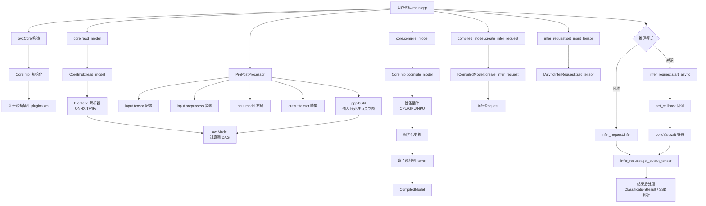
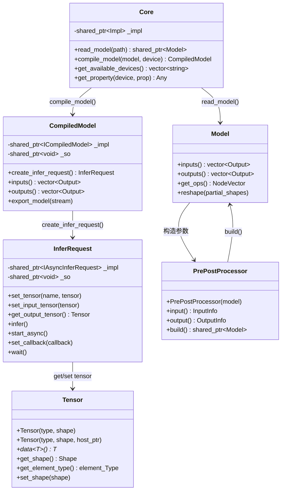
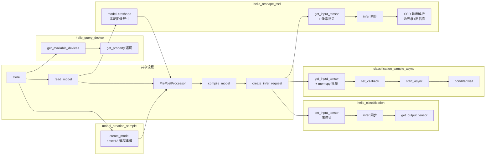

# OpenVINO 项目深度技术分析报告

## 目录

- [1. 项目概述](#1-项目概述)
  - [1.1 核心功能](#11-核心功能)
  - [1.2 应用场景](#12-应用场景)
  - [1.3 技术栈](#13-技术栈)
  - [1.4 整体模块划分](#14-整体模块划分)
- [2. 核心工作原理](#2-核心工作原理)
  - [2.1 推理流程总览](#21-推理流程总览)
  - [2.2 模型读取与解析](#22-模型读取与解析)
  - [2.3 预处理管线](#23-预处理管线)
  - [2.4 模型编译与设备适配](#24-模型编译与设备适配)
  - [2.5 推理执行与结果获取](#25-推理执行与结果获取)
- [3. Inference C++ Example 专项分析](#3-inference-c-example-专项分析)
  - [3.1 示例模块定位与作用](#31-示例模块定位与作用)
  - [3.2 文件结构与功能说明](#32-文件结构与功能说明)
  - [3.3 hello_classification 完整调用链路](#33-hello_classification-完整调用链路)
  - [3.4 classification_sample_async 异步推理链路](#34-classification_sample_async-异步推理链路)
  - [3.5 hello_query_device 设备查询链路](#35-hello_query_device-设备查询链路)
  - [3.6 hello_reshape_ssd 目标检测链路](#36-hello_reshape_ssd-目标检测链路)
  - [3.7 hello_nv12_input_classification NV12 输入链路](#37-hello_nv12_input_classification-nv12-输入链路)
  - [3.8 model_creation_sample 动态建模链路](#38-model_creation_sample-动态建模链路)
  - [3.9 调用关系可视化](#39-调用关系可视化)
- [4. 关键技术细节](#4-关键技术细节)
  - [4.1 内存管理与零拷贝设计](#41-内存管理与零拷贝设计)
  - [4.2 异步推理与多线程](#42-异步推理与多线程)
  - [4.3 接口设计与 Pimpl 模式](#43-接口设计与-pimpl-模式)
  - [4.4 跨模块交互与插件体系](#44-跨模块交互与插件体系)
  - [4.5 异常处理机制](#45-异常处理机制)
  - [4.6 构建系统设计](#46-构建系统设计)
- [5. 总结与思考](#5-总结与思考)
  - [5.1 项目设计优势](#51-项目设计优势)
  - [5.2 项目设计不足](#52-项目设计不足)
  - [5.3 核心逻辑可优化点](#53-核心逻辑可优化点)
  - [5.4 Inference C++ Example 调用设计思路](#54-inference-c-example-调用设计思路)

---

## 1. 项目概述

### 1.1 核心功能

OpenVINO（Open Visual Inference and Neural network Optimization）是由 Intel 开发的开源深度学习推理工具套件。其核心功能是将训练好的深度学习模型部署到各种 Intel 硬件（CPU、GPU、NPU 等）上进行高效推理，而无需重新训练模型。

核心能力包括：

- **多框架模型支持**：支持 ONNX、TensorFlow、TensorFlow Lite、PaddlePaddle、PyTorch、JAX 等主流深度学习框架的模型格式；
- **跨硬件推理**：统一 API 透明地运行在 CPU、集成/独立 GPU、NPU 等不同硬件加速器上；
- **自动优化**：通过图优化变换（Graph Transformations）、算子融合（Operator Fusion）、量化（Quantization）等技术自动提升推理性能；
- **预处理集成**：内置数据预处理管线（resize、颜色空间转换、layout 变换等），减少额外数据处理开销。

### 1.2 应用场景

| 场景 | 说明 |
|------|------|
| 边缘计算 | 在 IoT 设备、工业网关上部署轻量化推理 |
| 计算机视觉 | 图像分类、目标检测、语义分割、人脸识别 |
| 自然语言处理 | 文本分类、命名实体识别、机器翻译 |
| 医疗影像 | CT/MRI 图像分析、病灶检测 |
| 自动驾驶 | 传感器融合、障碍物检测、车道线识别 |
| 工业质检 | 缺陷检测、产品分类 |

### 1.3 技术栈

**C++ 核心技术：**

| 技术 | 用途 |
|------|------|
| C++17 标准 | 项目主体编译标准，使用 `std::filesystem`、`std::optional`、`std::string_view` 等现代特性 |
| 模板元编程 | 属性系统（`Property<T>`）、类型安全的张量访问 `Tensor::data<T>()` |
| 智能指针 | `std::shared_ptr` 管理 Model、Tensor、CompiledModel 等核心对象的生命周期 |
| Pimpl 模式 | Core、InferRequest、CompiledModel 均采用 Pimpl 隐藏实现细节，保证 ABI 稳定性 |
| 多线程 | `std::mutex`、`std::condition_variable` 实现异步推理回调机制 |
| CMake 构建系统 | 跨平台构建，宏 `ov_add_sample()` 统一示例编译流程 |

**其他技术栈：**

- Python 绑定（pybind11）
- C 语言绑定
- JavaScript 绑定（Node.js / napi）
- gflags（命令行参数解析）
- Protocol Buffers（TensorFlow 模型解析）

### 1.4 整体模块划分

```
openvino/
├── src/
│   ├── core/                  # 核心图表示层：ov::Model、Op、Shape、Tensor 基础定义
│   ├── inference/             # 推理引擎层：Core、CompiledModel、InferRequest
│   │   ├── include/openvino/runtime/  # 公共 API 头文件
│   │   ├── src/cpp/           # API 实现（core.cpp、infer_request.cpp 等）
│   │   ├── dev_api/           # 设备插件开发 API
│   │   └── tests/             # 推理引擎单元测试
│   ├── plugins/               # 硬件插件
│   │   ├── intel_cpu/         # CPU 插件
│   │   ├── intel_gpu/         # GPU 插件
│   │   ├── intel_npu/         # NPU 插件
│   │   ├── auto/              # AUTO 插件（自动设备选择）
│   │   └── hetero/            # HETERO 插件（跨设备异构执行）
│   ├── frontends/             # 前端解析器
│   │   ├── onnx/              # ONNX 模型前端
│   │   ├── tensorflow/        # TensorFlow 前端
│   │   ├── pytorch/           # PyTorch 前端
│   │   └── paddle/            # PaddlePaddle 前端
│   └── bindings/              # 多语言绑定
│       ├── python/            # Python API
│       ├── c/                 # C API
│       └── js/                # JavaScript API
├── samples/                   # 示例代码
│   ├── cpp/                   # C++ 示例（本报告重点分析对象）
│   ├── c/                     # C 示例
│   └── python/                # Python 示例
├── tools/                     # 开发工具（benchmark_tool、accuracy_checker 等）
├── thirdparty/                # 第三方依赖
├── docs/                      # 文档
└── tests/                     # 功能测试
```

---

## 2. 核心工作原理

### 2.1 推理流程总览

OpenVINO 的核心推理流程由以下五个阶段组成，每个阶段对应一个核心 C++ 类：

```
模型读取 → 预处理配置 → 模型编译 → 推理请求创建 → 执行推理
(Core)     (PrePostProcessor)  (Core)    (CompiledModel)   (InferRequest)
```

以 `hello_classification` 示例为例，其核心调用序列如下：

```cpp
// 文件: samples/cpp/hello_classification/main.cpp

// Step 1: 初始化运行时核心
ov::Core core;                                              // 第 48 行

// Step 2: 读取模型
std::shared_ptr<ov::Model> model = core.read_model(model_path);  // 第 52 行

// Step 3-4: 配置预处理
ov::preprocess::PrePostProcessor ppp(model);                // 第 80 行
model = ppp.build();                                        // 第 98 行

// Step 5: 编译模型到设备
ov::CompiledModel compiled_model = core.compile_model(model, device_name);  // 第 101 行

// Step 6: 创建推理请求
ov::InferRequest infer_request = compiled_model.create_infer_request();     // 第 104 行

// Step 7-8: 设置输入并执行推理
infer_request.set_input_tensor(input_tensor);               // 第 108 行
infer_request.infer();                                      // 第 111 行

// Step 9: 获取输出
const ov::Tensor& output_tensor = infer_request.get_output_tensor();  // 第 114 行
```

**设计理由：** 将推理过程拆分为多个明确阶段，使得每个阶段都可以独立配置和优化。例如，预处理在模型编译之前完成，可以被融合到计算图中以减少运行时开销；模型编译将通用的模型表示转化为设备特定的优化表示，只需执行一次。

### 2.2 模型读取与解析

`Core::read_model()` 是模型加载的入口函数，支持多种格式的模型文件：

```cpp
// 文件: src/inference/src/cpp/core.cpp, 第 80-84 行
std::shared_ptr<ov::Model> Core::read_model(const std::filesystem::path& model_path,
                                            const std::filesystem::path& bin_path,
                                            const ov::AnyMap& properties) const {
    OV_ITT_SCOPED_REGION_BASE(ov::itt::domains::OV, "Read model");
    OV_CORE_CALL_STATEMENT(return _impl->read_model(model_path, bin_path, properties););
}
```

**关键数据流：**

1. `Core::read_model()` 接收模型文件路径（.xml/.onnx/.pb/.pdmodel/.tflite 等）；
2. 内部委托给 `CoreImpl::read_model()`，根据文件扩展名选择对应的前端解析器（Frontend）；
3. 前端解析器将模型文件解析为统一的 `ov::Model` 图表示；
4. `ov::Model` 是一个有向无环图（DAG），节点为算子（`ov::Node`），边为张量连接。

**返回值：** `std::shared_ptr<ov::Model>` — 使用共享指针管理模型生命周期，允许多处引用同一模型，当最后一个引用释放时自动销毁。

### 2.3 预处理管线

OpenVINO 通过 `PrePostProcessor` 类提供声明式的预处理配置，将数据转换逻辑嵌入到计算图中：

```cpp
// 文件: samples/cpp/hello_classification/main.cpp, 第 80-98 行

ov::preprocess::PrePostProcessor ppp(model);  // 绑定到已读取的模型

// 配置输入张量信息：数据类型 u8、形状来自图像、布局 NHWC
ppp.input().tensor()
    .set_shape(input_shape)           // 设置输入张量形状
    .set_element_type(input_type)     // 设置数据精度 (uint8)
    .set_layout(tensor_layout);       // 设置数据布局 (NHWC)

// 添加预处理步骤：线性缩放
ppp.input().preprocess().resize(ov::preprocess::ResizeAlgorithm::RESIZE_LINEAR);

// 声明模型期望的布局
ppp.input().model().set_layout("NCHW");

// 设置输出精度
ppp.output().tensor().set_element_type(ov::element::f32);

// 构建：将预处理步骤插入计算图
model = ppp.build();
```

**设计优势：**

1. **声明式 API**：用户只需声明输入/输出的格式，框架自动推导需要的转换步骤；
2. **图融合**：`ppp.build()` 将 resize、layout 转换、类型转换等操作作为算子节点插入到模型图中，编译时可被融合到后续计算节点中，避免独立的预处理开销；
3. **零额外内存**：预处理操作在推理引擎内部执行，不需要用户分配额外的中间缓冲区。

### 2.4 模型编译与设备适配

`Core::compile_model()` 是性能优化的核心环节：

```cpp
// 文件: src/inference/src/cpp/core.cpp, 第 113-120 行
CompiledModel Core::compile_model(const std::shared_ptr<const ov::Model>& model,
                                  const std::string& device_name,
                                  const AnyMap& config) {
    OV_ITT_SCOPED_REGION_BASE(ov::itt::domains::Phases, "Compile model");
    OV_CORE_CALL_STATEMENT({
        auto exec = _impl->compile_model(model, device_name, config);
        return {exec._ptr, exec._so};
    });
}
```

**编译过程内部步骤：**

1. **设备解析**：根据 `device_name`（如 `"CPU"`、`"GPU"`）查找对应的设备插件；
2. **图优化变换**：应用一系列图优化 Pass（常量折叠、算子融合、内存优化等）；
3. **算子映射**：将通用算子映射为设备特定的计算核心（kernel）；
4. **内存规划**：为中间张量分配最优的内存布局和缓冲区复用策略；
5. **返回值**：`CompiledModel` 对象，包含已优化的可执行模型。

**关键设计：** `CompiledModel` 对象通过 `std::shared_ptr<void> _so` 持有对插件动态库的引用，确保在 `CompiledModel` 生命周期内插件库不会被卸载——这是跨模块资源管理的关键安全机制。

### 2.5 推理执行与结果获取

推理执行通过 `InferRequest` 对象完成，支持同步和异步两种模式：

**同步推理：**

```cpp
// 文件: src/inference/src/cpp/infer_request.cpp, 第 66-81 行

// 设置张量
void InferRequest::set_tensor(const std::string& name, const Tensor& tensor) {
    OV_INFER_REQ_CALL_STATEMENT({
        ov::Output<const ov::Node> port;
        OPENVINO_ASSERT(::getPort(port, name, {_impl->get_inputs(), _impl->get_outputs()}),
                        "Port for tensor name " + name + " was not found.");
        set_tensor(port, tensor);
    });
}
```

内部通过 `getPort()` 辅助函数查找与名称匹配的模型端口（遍历输入和输出端口列表，按名称集合匹配），然后调用底层 `IAsyncInferRequest::set_tensor()` 将张量数据绑定到对应端口。

**异步推理（回调模式）：**

```cpp
// 文件: samples/cpp/classification_sample_async/main.cpp, 第 164-197 行

// 设置异步回调
infer_request.set_callback([&](std::exception_ptr ex) {
    std::lock_guard<std::mutex> l(mutex);  // 线程安全
    if (ex) {
        exception_var = ex;
        condVar.notify_all();
        return;
    }
    cur_iteration++;
    if (cur_iteration < num_iterations) {
        infer_request.start_async();  // 继续下一轮异步推理
    } else {
        condVar.notify_one();         // 所有迭代完成，通知主线程
    }
});

infer_request.start_async();  // 启动第一次异步推理

// 主线程等待
std::unique_lock<std::mutex> lock(mutex);
condVar.wait(lock, [&] {
    if (exception_var) std::rethrow_exception(exception_var);
    return cur_iteration == num_iterations;
});
```

**设计理由：** 异步推理允许 CPU 在等待设备计算的同时执行其他工作（如准备下一批输入数据），最大化硬件利用率。回调机制配合条件变量实现了高效的同步等待，避免忙轮询浪费 CPU 资源。

---

## 3. Inference C++ Example 专项分析

### 3.1 示例模块定位与作用

`samples/cpp/` 目录是 OpenVINO 官方提供的 C++ 推理示例集合，定位为：

1. **入门教程**：为开发者提供从零开始使用 OpenVINO C++ API 的完整示例；
2. **API 演示**：每个示例聚焦于一个特定功能点（同步推理、异步推理、设备查询、模型动态 reshape、特殊输入格式、编程式建模）；
3. **最佳实践**：展示推荐的代码模式和错误处理方式；
4. **集成测试**：作为 CI 管线的一部分，验证 API 的端到端可用性。

### 3.2 文件结构与功能说明

```
samples/cpp/
├── CMakeLists.txt                          # 顶层构建文件，定义 ov_add_sample() 宏
├── build_samples.sh / .ps1 / .bat          # 独立构建脚本
├── common/                                 # 公共工具库
│   ├── CMakeLists.txt                      # 构建配置
│   ├── format_reader/                      # 图像读取器（BMP/PNG/JPEG 格式支持）
│   └── utils/                              # 通用工具
│       └── include/samples/
│           ├── args_helper.hpp             # 输入文件路径解析、精度配置
│           ├── common.hpp                  # 字符串工具、Unicode、性能计数排序
│           ├── classification_results.h    # 分类结果格式化输出
│           ├── slog.hpp                    # 结构化日志输出
│           ├── csv_dumper.hpp              # CSV 报告生成
│           └── latency_metrics.hpp         # 延迟指标统计
├── hello_classification/                   # 同步图像分类（最简推理流程）
│   ├── CMakeLists.txt
│   └── main.cpp                            # 127 行
├── classification_sample_async/            # 异步图像分类（回调+批处理）
│   ├── CMakeLists.txt
│   ├── classification_sample_async.h       # gflags 参数定义
│   └── main.cpp                            # 232 行
├── hello_query_device/                     # 设备信息查询
│   ├── CMakeLists.txt
│   └── main.cpp                            # 75 行
├── hello_reshape_ssd/                      # SSD 目标检测 + 动态 reshape
│   ├── CMakeLists.txt
│   └── main.cpp                            # 212 行
├── hello_nv12_input_classification/        # NV12 色彩格式输入分类
│   ├── CMakeLists.txt
│   └── main.cpp                            # 188 行
├── model_creation_sample/                  # 编程式构建 LeNet 模型
│   ├── CMakeLists.txt
│   ├── model_creation_sample.hpp           # 手写数字数据定义
│   └── main.cpp                            # 326 行
└── benchmark_app/                          # 性能基准测试工具
    └── ...                                 # 包含完整的性能测量框架
```

各示例功能对比：

| 示例名称 | 核心功能 | 推理模式 | 输入格式 | 预处理 | 代码行数 |
|----------|---------|---------|---------|--------|---------|
| hello_classification | 基础图像分类 | 同步 | 图像文件 | resize + layout 转换 | 127 |
| classification_sample_async | 多图批量分类 | 异步(回调) | 多图像文件 | u8→f32 + layout 转换 | 232 |
| hello_query_device | 设备属性枚举 | 无推理 | 无 | 无 | 75 |
| hello_reshape_ssd | SSD 目标检测 | 同步 | 图像文件 | u8→f32 + layout + resize | 212 |
| hello_nv12_input_classification | NV12 格式分类 | 同步 | NV12 原始数据 | NV12→BGR + resize | 188 |
| model_creation_sample | 动态建模+推理 | 同步 | 内置数据 | u8→f32 + layout 转换 | 326 |

### 3.3 hello_classification 完整调用链路

此示例是最典型的推理流程，展示了从模型加载到结果输出的完整路径。

**入口函数：** `tmain(int argc, tchar* argv[])` — 支持 Unicode 路径的跨平台入口点。

**完整调用链路（函数级）：**

| 步骤 | 调用函数 | 输入 | 输出 | 依赖 |
|------|---------|------|------|------|
| 1 | `ov::util::set_log_callback(log_callback)` | 回调函数 | void | ov::util |
| 2 | `ov::get_openvino_version()` | 无 | 版本字符串 | openvino core |
| 3 | `ov::Core core` 构造函数 | 空（使用默认 plugins.xml） | Core 实例 | CoreImpl, plugins.xml |
| 4 | `core.read_model(model_path)` | 模型文件路径 | `shared_ptr<Model>` | 前端解析器 |
| 5 | `printInputAndOutputsInfo(*model)` | Model 引用 | 控制台输出 | samples/common.hpp |
| 6 | `FormatReader::ReaderPtr reader(image_path)` | 图像路径 | 图像数据读取器 | format_reader 库 |
| 7 | `reader->getData()` | 无 | `shared_ptr<unsigned char>` 原始像素 | format_reader |
| 8 | `ov::Tensor(input_type, input_shape, input_data.get())` | 类型、形状、数据指针 | Tensor（零拷贝包装） | ov::Tensor |
| 9 | `ov::preprocess::PrePostProcessor ppp(model)` | Model 共享指针 | PPP 实例 | PrePostProcessor |
| 10 | `ppp.input().tensor().set_shape/type/layout()` | 形状、类型、布局 | PPP 自身引用（链式调用） | PrePostProcessor |
| 11 | `ppp.input().preprocess().resize(RESIZE_LINEAR)` | 缩放算法枚举 | PPP 自身引用 | PrePostProcessor |
| 12 | `ppp.input().model().set_layout("NCHW")` | 布局字符串 | PPP 自身引用 | PrePostProcessor |
| 13 | `ppp.output().tensor().set_element_type(f32)` | 数据类型 | PPP 自身引用 | PrePostProcessor |
| 14 | `ppp.build()` | 无 | 新 `shared_ptr<Model>`（含预处理节点） | PrePostProcessor |
| 15 | `core.compile_model(model, device_name)` | Model、设备名 | CompiledModel | 设备插件 |
| 16 | `compiled_model.create_infer_request()` | 无 | InferRequest | CompiledModel |
| 17 | `infer_request.set_input_tensor(input_tensor)` | Tensor | void | InferRequest |
| 18 | `infer_request.infer()` | 无 | void（同步阻塞） | 设备后端 |
| 19 | `infer_request.get_output_tensor()` | 无 | `const Tensor&` 输出结果 | InferRequest |
| 20 | `ClassificationResult(...).show()` | Tensor、图像名列表 | 控制台输出 Top-N 结果 | classification_results.h |

**异常处理：** 整个流程包裹在 `try-catch` 块中（第 25-123 行），捕获 `std::exception` 并输出到 `std::cerr`，返回 `EXIT_FAILURE`。

**关键代码片段 — 零拷贝张量创建：**

```cpp
// 文件: samples/cpp/hello_classification/main.cpp, 第 73-74 行
// 直接包装已有内存，不分配新缓冲区
ov::Tensor input_tensor = ov::Tensor(input_type, input_shape, input_data.get());
```

此行代码的意义在于：`ov::Tensor` 构造函数接受外部内存指针作为数据存储，不执行内存分配或数据拷贝。这是一种零拷贝（zero-copy）设计，图像读取器分配的内存直接被推理引擎使用，减少了不必要的内存开销。

### 3.4 classification_sample_async 异步推理链路

**入口函数：** `main(int argc, char* argv[])` — 标准 C++ 入口。

**与同步版本的关键差异：**

1. **命令行解析**：使用 gflags 库替代手动参数解析：

```cpp
// 文件: samples/cpp/classification_sample_async/main.cpp, 第 36-56 行
bool parse_and_check_command_line(int argc, char* argv[]) {
    gflags::ParseCommandLineNonHelpFlags(&argc, &argv, true);
    if (FLAGS_h) { show_usage(); showAvailableDevices(); return false; }
    if (FLAGS_m.empty()) throw std::logic_error("Model is required but not set.");
    if (FLAGS_i.empty()) throw std::logic_error("Input is required but not set.");
    return true;
}
```

2. **动态批处理**：根据输入图像数量自动设置 batch size：

```cpp
// 文件: samples/cpp/classification_sample_async/main.cpp, 第 133-137 行
const size_t batchSize = images_data.size();
ov::set_batch(model, batchSize);  // 动态修改模型的 batch 维度
```

3. **异步推理核心**：回调函数 + 条件变量组合：

```cpp
// 文件: samples/cpp/classification_sample_async/main.cpp, 第 158-197 行
size_t num_iterations = 10;
size_t cur_iteration = 0;
std::condition_variable condVar;
std::mutex mutex;
std::exception_ptr exception_var;

// 回调函数：在推理完成时由推理引擎在其工作线程中调用
infer_request.set_callback([&](std::exception_ptr ex) {
    std::lock_guard<std::mutex> l(mutex);    // 保护共享状态
    if (ex) {                                 // 异常传播
        exception_var = ex;
        condVar.notify_all();
        return;
    }
    cur_iteration++;
    if (cur_iteration < num_iterations) {
        infer_request.start_async();          // 链式启动下一次推理
    } else {
        condVar.notify_one();                 // 通知主线程完成
    }
});

infer_request.start_async();                  // 启动首次异步推理

// 主线程阻塞等待
std::unique_lock<std::mutex> lock(mutex);
condVar.wait(lock, [&] {
    if (exception_var) std::rethrow_exception(exception_var);
    return cur_iteration == num_iterations;
});
```

**关键设计细节：**

- **线程安全**：回调函数中使用 `std::lock_guard<std::mutex>` 保护 `cur_iteration` 和 `exception_var` 共享变量，因为回调在推理引擎的工作线程中执行，与主线程并发运行；
- **异常传播**：通过 `std::exception_ptr` 将推理线程中发生的异常传递到主线程，在 `condVar.wait()` 的谓词中 `rethrow`，确保异常不会被吞没；
- **链式异步**：在回调中直接调用 `start_async()` 启动下一轮推理，形成异步推理链，最大化设备利用率。

4. **批量数据填充**：

```cpp
// 文件: samples/cpp/classification_sample_async/main.cpp, 第 148-155 行
ov::Tensor input_tensor = infer_request.get_input_tensor();  // 获取预分配张量
for (size_t image_id = 0; image_id < images_data.size(); ++image_id) {
    const size_t image_size = shape_size(model->input().get_shape()) / batchSize;
    std::memcpy(input_tensor.data<std::uint8_t>() + image_id * image_size,
                images_data[image_id].get(), image_size);    // 逐图像拷贝到 batch 张量
}
```

此处使用 `get_input_tensor()` 获取推理引擎内部预分配的张量缓冲区，然后通过 `std::memcpy` 将多张图像依次写入 batch 维度的对应位置。

### 3.5 hello_query_device 设备查询链路

**入口函数：** `main(int argc, char* argv[])`

此示例不执行推理，仅查询系统可用设备及其属性。

**调用链路：**

```cpp
// 文件: samples/cpp/hello_query_device/main.cpp

// 1. 初始化核心
ov::Core core;                                                    // 第 45 行

// 2. 获取所有可用设备
std::vector<std::string> availableDevices = core.get_available_devices();  // 第 48 行

// 3. 遍历设备，查询属性
for (auto&& device : availableDevices) {
    auto supported_properties = core.get_property(device, ov::supported_properties);  // 第 57 行
    for (auto&& property : supported_properties) {
        if (property != ov::supported_properties.name()) {
            // 输出属性名称、可变性（Mutable/Immutable）和属性值
            print_any_value(core.get_property(device, property));  // 第 62 行
        }
    }
}
```

**关键函数：**

- `core.get_available_devices()`：扫描系统注册的所有设备插件，返回可用设备名称列表；
- `core.get_property(device, ov::supported_properties)`：获取设备支持的所有属性列表，每个属性包含名称和可变性标记（`PropertyMutability::RO` 或 `RW`）；
- `print_any_value()`：将 `ov::Any` 类型的属性值转换为字符串并输出。

**`ov::Any` 类型**：OpenVINO 的通用值容器（类似 `std::any`），支持任意类型值的存储和类型安全的提取。通过 `value.as<std::string>()` 转换为字符串表示。

### 3.6 hello_reshape_ssd 目标检测链路

**入口函数：** `main(int argc, char* argv[])`

此示例展示 SSD（Single Shot MultiBox Detector）目标检测的完整流程，包含模型验证、动态 reshape 和检测结果后处理。

**关键独特步骤：**

1. **模型验证 — DetectionOutput 层检查**：

```cpp
// 文件: samples/cpp/hello_reshape_ssd/main.cpp, 第 54-61 行
const ov::NodeVector ops = model->get_ops();  // 获取模型中所有算子节点
const auto it = std::find_if(ops.begin(), ops.end(), [](const std::shared_ptr<ov::Node>& node) {
    return std::string{node->get_type_name()} ==
           std::string{ov::opset9::DetectionOutput::get_type_info_static().name};
});
if (it == ops.end()) {
    throw std::logic_error("model does not contain DetectionOutput layer");
}
```

遍历模型的所有算子节点，查找 `DetectionOutput` 层以验证模型确实是 SSD 类型。

2. **动态 Reshape**：

```cpp
// 文件: samples/cpp/hello_reshape_ssd/main.cpp, 第 79-94 行
const ov::Layout model_layout{"NCHW"};
ov::Shape tensor_shape = model->input().get_shape();

tensor_shape[ov::layout::batch_idx(model_layout)] = batch_size;       // N
tensor_shape[ov::layout::channels_idx(model_layout)] = image_channels; // C
tensor_shape[ov::layout::height_idx(model_layout)] = image_height;     // H
tensor_shape[ov::layout::width_idx(model_layout)] = image_width;       // W

model->reshape({{model->input().get_any_name(), tensor_shape}});
```

使用 `ov::layout::*_idx()` 工具函数根据布局语义获取形状维度索引，然后调用 `model->reshape()` 将模型输入调整为实际图像尺寸。

3. **SSD 输出解析**：

```cpp
// 文件: samples/cpp/hello_reshape_ssd/main.cpp, 第 165-190 行
for (size_t object = 0; object < ssd_object_count; object++) {
    // SSD 输出格式: [image_id, label, conf, x_min, y_min, x_max, y_max]
    int image_id = static_cast<int>(detections[object * ssd_object_size + 0]);
    if (image_id < 0) break;  // 负 image_id 表示检测结束

    int label = static_cast<int>(detections[object * ssd_object_size + 1]);
    float confidence = detections[object * ssd_object_size + 2];
    int xmin = static_cast<int>(detections[object * ssd_object_size + 3] * image_width);
    int ymin = static_cast<int>(detections[object * ssd_object_size + 4] * image_height);
    int xmax = static_cast<int>(detections[object * ssd_object_size + 5] * image_width);
    int ymax = static_cast<int>(detections[object * ssd_object_size + 6] * image_height);

    if (confidence > 0.5f) {   // 置信度阈值过滤
        boxes.push_back(xmin); boxes.push_back(ymin);
        boxes.push_back(xmax - xmin); boxes.push_back(ymax - ymin);
    }
}
```

SSD 输出为二维数组，每行 7 个浮点数：图像 ID、类别标签、置信度、归一化坐标（x_min, y_min, x_max, y_max）。坐标需乘以图像尺寸还原为像素坐标。

### 3.7 hello_nv12_input_classification NV12 输入链路

**入口函数：** `main(int argc, char* argv[])`

此示例演示处理 NV12 色彩格式输入（常见于摄像头原始帧）的分类推理。

**独特技术点：**

1. **图像尺寸解析**：

```cpp
// 文件: samples/cpp/hello_nv12_input_classification/main.cpp, 第 40-63 行
std::pair<size_t, size_t> parse_image_size(const std::string& size_string) {
    auto delimiter_pos = size_string.find("x");
    // 解析 "WIDTHxHEIGHT" 格式
    size_t width = static_cast<size_t>(std::stoull(size_string.substr(0, delimiter_pos)));
    size_t height = static_cast<size_t>(std::stoull(size_string.substr(delimiter_pos + 1)));
    // 验证：宽高不为零且为偶数（NV12 格式要求）
    if (width % 2 != 0 || height % 2 != 0)
        throw std::runtime_error("width and height must be even numbers");
    return {width, height};
}
```

NV12 格式要求图像宽高为偶数，因为色度（chroma）分量的分辨率是亮度（luma）的一半。

2. **NV12 预处理管线**：

```cpp
// 文件: samples/cpp/hello_nv12_input_classification/main.cpp, 第 113-138 行
PrePostProcessor ppp = PrePostProcessor(model);
InputInfo& input_info = ppp.input(input_tensor_name);

input_info.tensor()
    .set_element_type(ov::element::u8)
    .set_color_format(ColorFormat::NV12_SINGLE_PLANE)     // NV12 单平面格式
    .set_spatial_static_shape(input_height, input_width);  // 空间维度

input_info.preprocess()
    .convert_element_type(ov::element::f32)   // u8 → f32
    .convert_color(ColorFormat::BGR)           // NV12 → BGR
    .resize(ResizeAlgorithm::RESIZE_LINEAR);   // 线性缩放

input_info.model().set_layout("NCHW");
model = ppp.build();
```

3. **NV12 张量构造**：

```cpp
// 文件: samples/cpp/hello_nv12_input_classification/main.cpp, 第 149 行
ov::Tensor input_tensor{ov::element::u8, {batch, input_height * 3 / 2, input_width, 1}, image_data.get()};
```

NV12 格式的内存布局：Y 平面（`height × width`）+ UV 平面（`height/2 × width`），总高度 = `height * 3 / 2`。

### 3.8 model_creation_sample 动态建模链路

**入口函数：** `main(int argc, char* argv[])`

此示例展示不从文件加载模型，而是通过 OpenVINO 的 opset API 编程式构建 LeNet 卷积神经网络。

**模型构建核心流程（`create_model()` 函数）：**

```cpp
// 文件: samples/cpp/model_creation_sample/main.cpp, 第 78-215 行

std::shared_ptr<ov::Model> create_model(const std::string& path_to_weights) {
    const ov::Tensor weights = read_weights(path_to_weights);  // 读取权重文件
    const std::uint8_t* data = weights.data<std::uint8_t>();   // 获取原始数据指针

    // 输入节点: [64, 1, 28, 28] (batch=64, 单通道, 28x28 像素)
    auto paramNode = std::make_shared<ov::opset13::Parameter>(
        ov::element::Type_t::f32, ov::Shape({64, 1, 28, 28}));

    // Conv1: 20 个 5x5 滤波器
    auto convFirstShape = Shape{20, 1, 5, 5};
    auto convolutionFirstConstantNode = std::make_shared<opset13::Constant>(
        element::Type_t::f32, convFirstShape, data);
    auto convolutionNodeFirst = std::make_shared<opset13::Convolution>(
        paramNode->output(0), convolutionFirstConstantNode->output(0),
        Strides({1, 1}), CoordinateDiff({0, 0}), CoordinateDiff({0, 0}), Strides({1, 1}));

    // Add1: 偏置项
    auto addFirstConstantNode = std::make_shared<opset13::Constant>(
        element::Type_t::f32, Shape{1, 20, 1, 1}, data + offset);
    auto addNodeFirst = std::make_shared<opset13::Add>(
        convolutionNodeFirst->output(0), addFirstConstantNode->output(0));

    // MaxPool1: 2x2 步长为 2
    auto maxPoolingNodeFirst = std::make_shared<opset13::MaxPool>(
        addNodeFirst->output(0), Strides{2, 2}, Strides{1, 1},
        Shape{0, 0}, Shape{0, 0}, Shape{2, 2}, op::RoundingType::CEIL);

    // ... Conv2 + Add2 + MaxPool2 (类似结构)

    // Reshape → MatMul(500) → Add → ReLU → Reshape → MatMul(10) → Add → Softmax
    auto softMaxNode = std::make_shared<opset13::Softmax>(add4Node->output(0), 1);

    // 构建 ov::Model
    auto result_full = std::make_shared<opset13::Result>(softMaxNode->output(0));
    return std::make_shared<ov::Model>(result_full, ov::ParameterVector{paramNode}, "lenet");
}
```

**权重文件管理：**

```cpp
// 文件: samples/cpp/model_creation_sample/main.cpp, 第 60-72 行
ov::Tensor read_weights(const std::string& filepath) {
    std::ifstream weightFile(filepath, std::ifstream::ate | std::ifstream::binary);
    int64_t fileSize = weightFile.tellg();
    OPENVINO_ASSERT(fileSize == LENET_WEIGHTS_SIZE,  // 验证文件大小 = 1724336 字节
                    "Incorrect weights file.");
    ov::Tensor weights(ov::element::u8, {static_cast<size_t>(fileSize)});
    read_file(filepath, weights.data(), weights.get_byte_size());
    return weights;
}
```

权重以 `ov::Tensor` 形式存储，直接作为 `opset13::Constant` 节点的初始化数据。通过偏移量 `offset` 在连续的权重缓冲区中定位每层的权重起始位置。

**设计优势：**

- **算子级建模**：使用 opset13 命名空间中的标准算子（Convolution、MaxPool、MatMul 等）构建计算图，与文件加载的模型使用完全相同的内部表示；
- **权重共享**：所有层的权重存储在一个连续缓冲区中，通过指针偏移访问，减少内存分配次数。

### 3.9 调用关系可视化

#### 3.9.1 核心推理流程（所有示例通用）



#### 3.9.2 类依赖关系



#### 3.9.3 各示例调用差异对比



---

## 4. 关键技术细节

### 4.1 内存管理与零拷贝设计

OpenVINO 在张量管理上提供了两种内存模式：

**模式 1：框架分配内存**

```cpp
ov::Tensor tensor(ov::element::f32, {1, 3, 224, 224});  // 框架内部分配缓冲区
float* data = tensor.data<float>();                       // 获取内部指针
```

**模式 2：零拷贝包装外部内存**

```cpp
// 文件: samples/cpp/hello_classification/main.cpp, 第 73-74 行
// 包装已有内存，不分配新缓冲区
ov::Tensor input_tensor = ov::Tensor(input_type, input_shape, input_data.get());
```

零拷贝设计的核心价值：在图像处理场景中，图像数据通常由外部库（如 OpenCV、自定义读取器）分配并填充。如果推理引擎需要再拷贝一份到自己的缓冲区，会浪费内存带宽，尤其在高分辨率图像和高吞吐量场景下影响显著。

**生命周期管理要点：** 使用零拷贝模式时，用户必须确保外部内存在 `InferRequest::infer()` 或 `start_async()` 完成之前保持有效。在 hello_classification 示例中，`input_data`（`std::shared_ptr<unsigned char>`）的生命周期覆盖了整个 `try` 块，因此安全。

### 4.2 异步推理与多线程

异步推理的线程模型：

```
主线程                              推理引擎工作线程
  |                                      |
  |-- start_async() ------------------>  |
  |                                      |-- 执行推理计算
  |-- 可做其他工作（准备下一批数据）       |
  |                                      |-- 推理完成
  |  <-- callback() 在工作线程中调用 --  |
  |                                      |
  |-- condVar.wait() ----------------->  |
  |                                      |
```

**线程安全关键点（来自 classification_sample_async）：**

```cpp
// 文件: samples/cpp/classification_sample_async/main.cpp, 第 160-162 行
std::condition_variable condVar;
std::mutex mutex;
std::exception_ptr exception_var;  // 跨线程传递异常
```

- `mutex` 保护 `cur_iteration`（迭代计数器）和 `exception_var`（异常指针）；
- 回调函数使用 `std::lock_guard` 加锁后修改共享状态；
- 主线程使用 `condVar.wait()` 配合谓词等待，避免虚假唤醒（spurious wakeup）。

### 4.3 接口设计与 Pimpl 模式

OpenVINO 的所有核心公共类均采用 Pimpl（Pointer to Implementation）模式：

```cpp
// 文件: src/inference/include/openvino/runtime/core.hpp, 第 37-39 行
class OPENVINO_RUNTIME_API Core {
    class Impl;
    std::shared_ptr<Impl> _impl;
    // ...
};

// 文件: src/inference/include/openvino/runtime/infer_request.hpp, 第 31-33 行
class OPENVINO_RUNTIME_API InferRequest {
    std::shared_ptr<ov::IAsyncInferRequest> _impl;
    std::shared_ptr<void> _so;
    // ...
};

// 文件: src/inference/include/openvino/runtime/compiled_model.hpp, 第 36-38 行
class OPENVINO_RUNTIME_API CompiledModel {
    std::shared_ptr<ov::ICompiledModel> _impl;
    std::shared_ptr<void> _so;
    // ...
};
```

**设计理由：**

1. **ABI 稳定性**：公共头文件中只暴露指针，实现类的变更不会影响公共 API 的二进制兼容性；
2. **编译隔离**：用户代码不需要包含实现类的头文件，减少编译依赖和编译时间；
3. **插件生命周期管理**：`_so`（`shared_ptr<void>`）持有对动态库的引用。当 `CompiledModel` 或 `InferRequest` 被销毁时，先释放 `_impl`（实现对象），再释放 `_so`（库引用），确保正确的卸载顺序。

**析构顺序保证：**

```cpp
// 文件: src/inference/include/openvino/runtime/infer_request.hpp, 第 77-81 行
// 注释: 为了在默认生成的赋值运算符中保持销毁顺序，
// _impl 存储在 _so 之前
~InferRequest();

// 文件: src/inference/src/cpp/infer_request.cpp, 第 56-58 行
InferRequest::~InferRequest() {
    _impl = {};  // 先释放实现对象
}
// _so 随后由编译器生成的析构逻辑释放
```

### 4.4 跨模块交互与插件体系

OpenVINO 采用插件架构实现硬件抽象：

```
┌─────────────────────────────────────────────────┐
│                  用户应用代码                      │
│          (samples/cpp/hello_classification)        │
├─────────────────────────────────────────────────┤
│               OpenVINO Runtime API                │
│    (ov::Core, ov::CompiledModel, ov::InferRequest) │
├─────────────────────────────────────────────────┤
│              CoreImpl (插件管理器)                  │
│   ┌──────────┬──────────┬──────────┬──────────┐   │
│   │ CPU 插件  │ GPU 插件  │ NPU 插件  │ AUTO 插件 │   │
│   │(libcpu.so)│(libgpu.so)│(libnpu.so)│(libauto.so)│   │
│   └──────────┴──────────┴──────────┴──────────┘   │
├─────────────────────────────────────────────────┤
│                    硬件层                          │
│           Intel CPU / GPU / NPU / ...              │
└─────────────────────────────────────────────────┘
```

**插件注册机制：**

```cpp
// 文件: src/inference/src/cpp/core.cpp, 第 67-74 行
Core::Core(const std::filesystem::path& xml_config_file) : _impl(std::make_shared<Impl>()) {
    if (const auto xml_path = find_plugins_xml(xml_config_file); !xml_path.empty()) {
        // 从 XML 配置文件注册插件（动态库构建）
        OV_CORE_CALL_STATEMENT(_impl->register_plugins_in_registry(xml_path, xml_config_file.empty());)
    }
    // 从编译时预定义列表注册插件（静态库构建）
    OV_CORE_CALL_STATEMENT(_impl->register_compile_time_plugins();)
}
```

**插件查找策略（`find_plugins_xml()`）：**

```cpp
// 文件: src/inference/src/cpp/core.cpp, 第 19-47 行
std::filesystem::path find_plugins_xml(const std::filesystem::path& xml_file) {
    // 搜索优先级：
    // 1. 用户指定的绝对/相对路径
    // 2. libopenvino.so 同目录下的 openvino-X.Y.Z/plugins.xml
    // 3. libopenvino.so 同目录下的 plugins.xml
    // ...
}
```

### 4.5 异常处理机制

OpenVINO 采用宏封装的统一异常处理模式：

**Core 层异常宏：**

```cpp
// 文件: src/inference/src/cpp/core.cpp, 第 51-58 行
#define OV_CORE_CALL_STATEMENT(...)             \
    try {                                       \
        __VA_ARGS__;                            \
    } catch (const std::exception& ex) {        \
        OPENVINO_THROW(ex.what());              \
    } catch (...) {                             \
        OPENVINO_THROW("Unexpected exception"); \
    }
```

**InferRequest 层异常宏（增加 Busy/Cancelled 异常透传）：**

```cpp
// 文件: src/inference/src/cpp/infer_request.cpp, 第 21-33 行
#define OV_INFER_REQ_CALL_STATEMENT(...)                                    \
    OPENVINO_ASSERT(_impl != nullptr, "InferRequest was not initialized."); \
    try {                                                                   \
        __VA_ARGS__;                                                        \
    } catch (const ov::Busy&) {                                             \
        throw;                                                              \
    } catch (const ov::Cancelled&) {                                        \
        throw;                                                              \
    } catch (const std::exception& ex) {                                    \
        OPENVINO_THROW(ex.what());                                          \
    } catch (...) {                                                         \
        OPENVINO_THROW("Unexpected exception");                             \
    }
```

**设计要点：**

1. 所有公共 API 方法都通过宏包裹，确保内部异常不会泄漏到用户代码——所有异常统一转换为 `ov::Exception`（继承自 `std::exception`）；
2. `ov::Busy` 和 `ov::Cancelled` 是需要透传的特殊异常：`Busy` 表示推理请求正忙（异步场景），`Cancelled` 表示推理被取消，这些异常有明确的语义，用户代码需要直接处理；
3. 在 `InferRequest` 的宏中额外添加了 `_impl != nullptr` 断言，防止在未初始化的对象上调用方法。

**示例层异常处理：**

```cpp
// 文件: samples/cpp/hello_classification/main.cpp, 第 120-123 行
} catch (const std::exception& ex) {
    std::cerr << ex.what() << std::endl;
    return EXIT_FAILURE;
}
```

### 4.6 构建系统设计

**核心宏 `ov_add_sample()`：**

```cmake
# 文件: samples/cpp/CMakeLists.txt, 第 174-248 行
macro(ov_add_sample)
    set(options EXCLUDE_CLANG_FORMAT)
    set(oneValueArgs NAME)
    set(multiValueArgs SOURCES HEADERS DEPENDENCIES INCLUDE_DIRECTORIES)
    cmake_parse_arguments(SAMPLE "${options}" "${oneValueArgs}" "${multiValueArgs}" ${ARGN})

    # 创建可执行目标
    add_executable(${SAMPLE_NAME} ${SAMPLE_SOURCES} ${SAMPLE_HEADERS})

    # 查找并链接 OpenVINO Runtime
    find_package(OpenVINO REQUIRED COMPONENTS Runtime)
    set(ov_link_libraries openvino::runtime)

    # 链接依赖
    target_link_libraries(${SAMPLE_NAME} PRIVATE ${ov_link_libraries} Threads::Threads ${SAMPLE_DEPENDENCIES})

    # 安装到 samples_bin/
    install(TARGETS ${SAMPLE_NAME} RUNTIME DESTINATION samples_bin/ COMPONENT samples_bin EXCLUDE_FROM_ALL)
endmacro()
```

**使用示例（hello_classification/CMakeLists.txt）：**

```cmake
ov_add_sample(NAME hello_classification
              SOURCES "${CMAKE_CURRENT_SOURCE_DIR}/main.cpp"
              DEPENDENCIES format_reader ie_samples_utils)
```

**设计优势：**

1. **标准化**：所有示例使用同一个宏构建，确保编译选项、链接库、安装路径的一致性；
2. **依赖声明**：通过 `DEPENDENCIES` 参数显式声明依赖的辅助库（`format_reader`、`ie_samples_utils`、`gflags`）；
3. **独立构建**：通过 `build_samples.sh` 脚本可以独立于 OpenVINO 主项目构建示例，只需安装好 OpenVINO Runtime；
4. **C++17 标准**：在 `CMakeLists.txt` 第 104 行设置 `CMAKE_CXX_STANDARD 17`。

---

## 5. 总结与思考

### 5.1 项目设计优势

**1. 层次化的 API 设计**

OpenVINO 将推理流程分为 `Core → Model → PrePostProcessor → CompiledModel → InferRequest → Tensor` 六个层次清晰的抽象，每个类职责单一：
- `Core` 管理插件和模型加载；
- `Model` 表示设备无关的计算图；
- `PrePostProcessor` 封装数据预处理逻辑；
- `CompiledModel` 表示设备特定的优化模型；
- `InferRequest` 管理单次推理的执行状态；
- `Tensor` 管理数据缓冲区。

**2. Pimpl 模式保证 ABI 稳定性**

所有公共类使用 `std::shared_ptr<Impl>` 隐藏实现，使得内部优化和重构不会破坏用户代码的二进制兼容性。这对于作为共享库分发的推理引擎至关重要。

**3. 声明式预处理管线**

`PrePostProcessor` 的 Builder 模式设计（链式调用 `.set_element_type().set_layout().set_shape()`）使预处理配置既简洁又类型安全。更关键的是，`build()` 将预处理步骤转化为计算图节点，使得编译器可以将其与后续计算融合。

**4. 统一的多硬件抽象**

通过插件体系，用户代码只需修改 `device_name` 字符串（`"CPU"` → `"GPU"`）即可切换运行设备，无需任何代码逻辑变更。

**5. 零拷贝张量与灵活的内存管理**

`ov::Tensor` 同时支持框架托管内存和用户外部内存两种模式，在性能敏感场景中减少不必要的数据拷贝。

### 5.2 项目设计不足

**1. 示例代码的异常处理过于简单**

多数示例仅捕获 `std::exception` 并打印到 `stderr`，缺乏分类处理（如区分模型格式错误、设备不可用、内存不足等场景），不利于实际生产环境的错误诊断。

**2. 编译时间较长**

由于大量使用模板元编程（属性系统、类型安全张量访问），加之项目规模庞大（数百万行代码），完整编译耗时较长，增加开发迭代成本。

**3. 部分示例的输入验证不够鲁棒**

例如 `hello_reshape_ssd` 中通过 `std::find_if` 遍历所有算子查找 `DetectionOutput` 层，时间复杂度 O(N)。虽然在模型规模不大时可接受，但缺乏更高效的层类型索引机制。

### 5.3 核心逻辑可优化点

**1. 预处理管线的运行时编译**

当前 `PrePostProcessor::build()` 在每次调用时重新构建预处理子图。对于重复使用相同预处理配置的场景，可以缓存已构建的子图以避免重复开销。

**2. 异步推理的错误恢复**

`classification_sample_async` 中异步推理链在异常发生时直接 `notify_all()` 退出，缺乏重试或降级机制。在生产环境中，可以增加：
- 可配置的重试策略；
- 异常计数与断路器模式；
- 回退到同步推理的降级方案。

**3. 批量推理的内存拷贝优化**

在 `classification_sample_async` 和 `model_creation_sample` 中，批量数据通过 `std::memcpy` 逐图像拷贝到 batch 张量。对于大 batch size，可以考虑：
- 使用内存映射（mmap）直接将图像文件映射到张量内存；
- 利用异步 DMA 传输重叠计算和数据拷贝。

### 5.4 Inference C++ Example 调用设计思路

**渐进式学习路径设计：**

示例按复杂度递进排列，形成清晰的学习路径：

```
hello_classification          →  最简推理：同步 + 单图
  ↓
hello_query_device            →  设备管理：无推理，纯查询
  ↓
hello_reshape_ssd             →  模型适配：动态 reshape + 目标检测后处理
  ↓
hello_nv12_input_classification →  特殊输入：NV12 色彩空间处理
  ↓
classification_sample_async   →  高级模式：异步推理 + 批处理 + 回调
  ↓
model_creation_sample         →  深度定制：编程式模型构建 + 权重管理
```

**代码复用与模块化：**

所有示例共享 `common/` 工具库（`format_reader`、`slog`、`classification_results`），避免了代码重复。通过 `ov_add_sample()` 宏统一构建配置，降低了维护成本。

**一致的代码结构：**

每个示例都遵循相同的代码模板：参数解析 → Core 初始化 → 模型加载 → 预处理 → 编译 → 推理 → 结果处理，配合编号注释（`// Step 1.`、`// Step 2.` 等），使读者可以在不同示例间快速定位对应步骤。

---

> **报告生成时间**：2026-03-06
>
> **基准版本**：基于 OpenVINO 源码仓库 commit `3de27668` 分析
>
> **分析范围**：`samples/cpp/` 全部 6 个推理示例 + `src/inference/` 核心 API
>
> **代码引用**：所有代码片段均标注了文件路径与行号，基于上述 commit 的实际源码。由于代码持续演进，行号可能在后续版本中发生偏移，建议结合函数名和上下文定位
